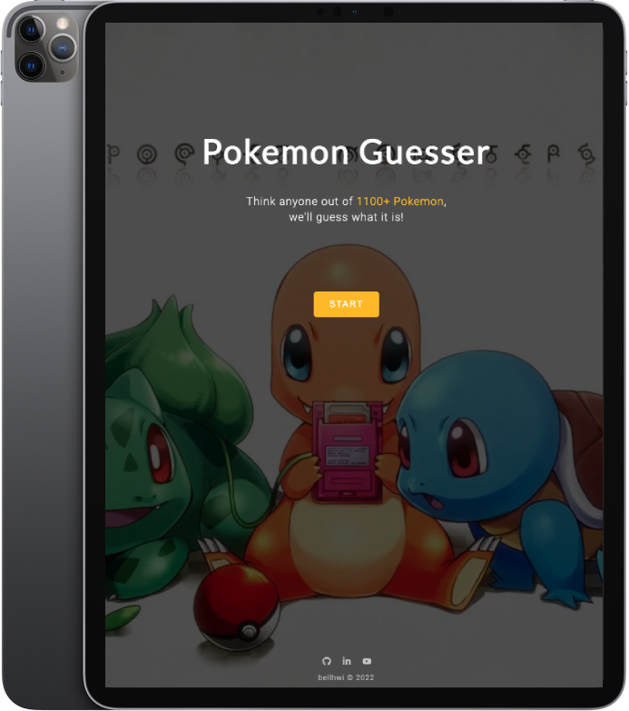

# Pokemon Guesser

> [PokeAPI](https://pokeapi.co/) project built with React & Redux.

## Overview

- **How did I build it?** Pokemon Guesser is an API project where users can play a guess game. I made this website out of my interest in Pokemon. I wrote a code logic that questions might vary based on user answers. I implemented algorithms that narrow down the Pokemon until the only one is left.

- **What was the most challenging part?** The goal of this project was to collect information of the Pokemon that users have come up with and guess it. I had to write the code logic that can guess the user's Pokemon accurately. I needed to figure out how to filter the common item between different arrays.

- **How did I solve it?** I used the 'Filter' function of Javascript to find duplicates. After that, I used the 'Set' object to remove duplicates and leave only one. I applied this code logic on each question until the user reached the final result.

- **What was the most fun part?** This was my first API project that I developed with React and Redux. I enjoyed playing around with the Pokemon API which is my favorite IP. At the same time, I gained a better understanding on how Redux works due to this project. Seeing this mini Pokemon game work as expected was the most fun part.

- **What did I learn?** I learned how to use React to build a Single Page Application. I was able to understand how the components, props and states work in React. I realized what is the benefit of using Redux from the project, as well. I could manage global states way easier with Redux compared to using React only. I learned how to build a website using an external API. Along the way, I could understand how to deal with JSON data.

- **What will I do differently next time?** If I were to start over this project, I'd love to start building with 'mobile-first' practice. I started building the project focusing on the design for a desktop screen. I didn't consider responsive design at that point. By the time I finished designing, I found out that it's hard to apply responsive design with the styles I wrote in CSS. I had to start over writing new CSS codes for some parts to fix the problem. I'll target mobile screens first in terms of design next time.

## Technical Decision

- I separated two different fetch API logic to ‘onClick’ and ‘onChange’ on purpose. The ‘onChange’ is to fetch the data for the next question. The ‘onClick’ is to fetch the corresponding data based on the user’s selection. That way I could reduce the delay between page loading. [Example code](https://github.com/bellhwi/pokemon-guesser/blob/main/src/components/Color.jsx#L20-L30)

- I used Sass to write the CSS code more efficiently. I could reduce repetitive code by using mixin syntax in Sass. [Example code](https://github.com/bellhwi/pokemon-guesser/blob/main/src/App.scss#L7-L48)

## Features

- 🤖 Different question algorithm by answer: [Example code](https://github.com/bellhwi/pokemon-guesser/blob/main/src/components/FirstCharacter.jsx#L80-L105)
- 🎯 User selection filter: [Example code](https://github.com/bellhwi/pokemon-guesser/blob/main/src/components/Letter.jsx#L29-L43)
- 🕹️ [PokeAPI](https://pokeapi.co/) project
- 🚫 Not found page
- 📱 Responsive design

## Tech

    
    
    
    
    
    

